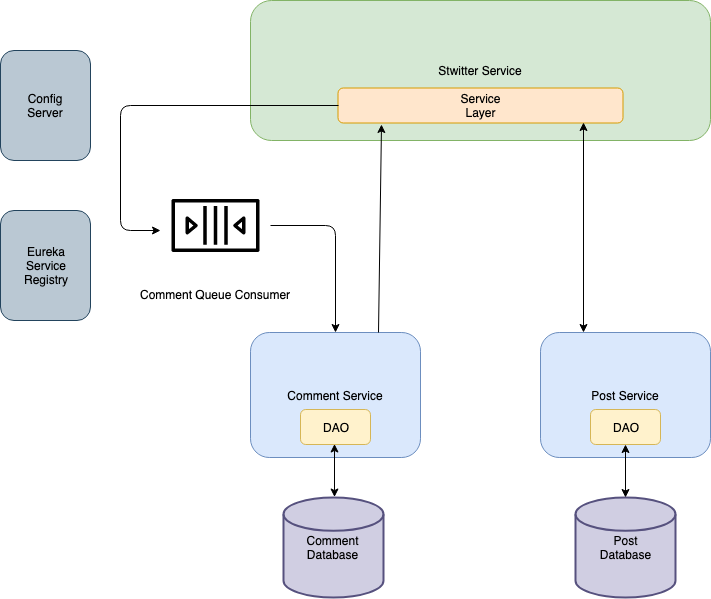

# stwitter-service

## Description
A RESTful API based off Twitter built with a microservice architecture.

## Technologies Used
* Java
* Spring Boot
* MySQL
* Config Server
* Eureka Server
* RabbitMQ
* Feign
* Mockito
* Caching
* Swagger

## Built With
* Intellij Idea

